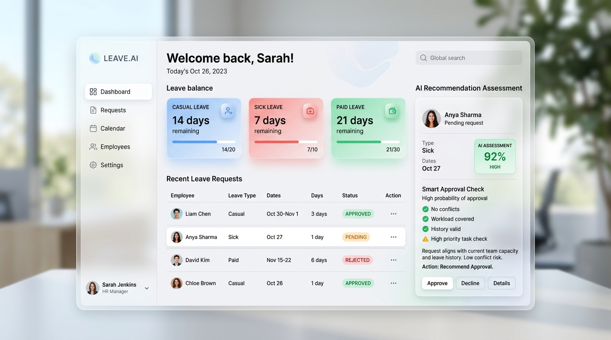

# AI-Powered Leave Management Agent 📅

A production-ready, beautiful, and secure Leave Management System built with **Streamlit**, **SQLite**, and **Google Gemini AI**.

This application provides employees and administrators with a centralized platform to request, review, and analyze leaves. A smart AI agent evaluates request details in real-time, matching parameters like reasons and balances to make immediate recommendations for administrators.

---

## 🎨 Application Preview
Below is a high-fidelity visual preview of the dashboard:



---

## 🚀 Key Features

### 👤 Employee Portal
- **Real-Time Leave Balances**: Instantly check available Casual, Sick, and Paid leave balances in premium glassmorphic widgets.
- **Overlapping Protection**: Date validations prevent duplicate applications and double-bookings.
- **Instant AI Feedback**: Submitting an application triggers an immediate preliminary recommendation from the AI agent.
- **Detailed History**: Chronological view of past applications with colored status badges.
- **Profile Password Update**: Secure password changes with current credential verification.

### 🛡️ Admin Dashboard
- **Intelligent Reviews**: Review pending applications side-by-side with remaining employee balances and AI assessments.
- **Audit Logging**: Logs every status update and balance modification to a secure system audit log.
- **Interactive Analytics**: Real-time charts of leave distributions and status percentages powered by Plotly.
- **Exporting Capabilities**: Download complete Excel/CSV data or generate print-ready PDF Executive Summaries with `fpdf2`.

---

## 🛠️ Tech Stack & Architecture

- **Frontend & Routing**: Streamlit
- **Data Visualization**: Plotly Express & Pandas
- **Database**: SQLite3
- **Security & Hashing**: Bcrypt
- **Document Generation**: FPDF2
- **Artificial Intelligence**: Google Generative AI (`gemini-2.5-flash` model)

---

## 📋 Database Schema

The database `leave_management.db` contains three tables:

- **`users`**: Manages credentials, roles (`admin`, `employee`), and remaining balances.
- **`leave_requests`**: Tracks duration dates, reasons, and AI feedback.
- **`audit_logs`**: Logs all admin decisions for security audit trails.

---

## 🏁 Getting Started

### Prerequisites
- Python 3.10 or 3.11
- (Optional) Google Gemini API Key

### Local Installation

1. **Clone the Repository** (or enter the directory):
   ```bash
   cd "Leave management Agent"
   ```

2. **Install Dependencies**:
   ```bash
   pip install -r requirements.txt
   ```

3. **Configure Environment Variables (Optional for AI)**:
   - For complete AI assessments, set your Gemini API key:
     ```bash
     # Windows (Command Prompt)
     set GEMINI_API_KEY="your-api-key"
     
     # Windows (PowerShell)
     $env:GEMINI_API_KEY="your-api-key"
     
     # Linux / MacOS
     export GEMINI_API_KEY="your-api-key"
     ```
   - *Note: If no API key is found, the system runs on a smart heuristic rule engine fallback.*

4. **Launch the Application**:
   ```bash
   streamlit run app.py
   ```

---

## 🔐 Default Credentials

The database initializes and seeds itself with three default accounts:

| Username | Password | Role | Name |
| :--- | :--- | :--- | :--- |
| **`admin`** | `admin123` | Administrator | System Administrator |
| **`alice`** | `password123` | Employee | Alice Smith |
| **`bob`** | `password123` | Employee | Bob Jones |

---

## 🐳 Docker Deployment

You can build and run this application inside an isolated Docker container:

1. **Build the Image**:
   ```bash
   docker build -t leave-agent .
   ```

2. **Run the Container**:
   ```bash
   docker run -p 8501:8501 --env GEMINI_API_KEY="your-api-key" leave-agent
   ```

3. Open your browser and navigate to `http://localhost:8501`.

---

## ☁️ Streamlit Community Cloud Deploy Ready

This project is fully structured for easy deployment on **Streamlit Community Cloud**:
1. Push this repository to GitHub (include `.github/`, `app.py`, `database.py`, `ai_agent.py`, `auth.py`, `employee.py`, `admin.py`, `requirements.txt`, and `Dockerfile`).
2. Link the repository on the Streamlit Cloud dashboard.
3. Add your Gemini API key in Streamlit **Secrets** under App Settings:
   ```toml
   GEMINI_API_KEY = "your_gemini_api_key_here"
   ```


---

## 🚀 Deployment Guide

### Deploy to Streamlit Cloud (Free Hosting)

#### Step 1: Prepare Repository

Make sure all changes are committed:
```bash
git add .
git commit -m "Ready for deployment"
git push origin main
```

#### Step 2: Deploy on Streamlit Cloud

1. Go to **[share.streamlit.io](https://share.streamlit.io)**
2. **Sign in** with your GitHub account
3. Click **"New app"** button
4. Fill in the details:
   - **Repository:** `nishanth895/leave-management-agent`
   - **Branch:** `main`
   - **Main file path:** `app.py`

5. Click **"Advanced settings"** and add secrets:
```toml
GEMINI_API_KEY = "your-google-gemini-api-key"
```

6. Click **"Deploy"** 

🎉 Your app will be live at: `https://your-app-name.streamlit.app`

#### Get Gemini API Key:
1. Visit [Google AI Studio](https://aistudio.google.com/app/apikey)
2. Create API key
3. Copy and paste in Streamlit secrets

---

## 🔐 Default Credentials

After deployment, use these credentials to login:

### 👨‍💼 Admin Dashboard
- **Email:** `admin@example.com`
- **Password:** `admin123`

### 👤 Employee Portal  
- **Email:** `alice@example.com`
- **Password:** `password123`
- **Email:** `bob@example.com`
- **Password:** `password123`

⚠️ **Security:** Change default passwords after first login in production!

---

## 📱 Local Development

### Quick Start (Windows)

**Easiest way:**
1. Double-click `🚀 START HERE.bat`
2. Browser opens automatically at http://localhost:8501

**Alternative:**
1. Double-click `🌐 OPEN IN BROWSER.html`
2. Application loads automatically

### Manual Start

```bash
cd "Leave management Agent"
pip install -r requirements.txt
streamlit run app.py
```

Then open: http://localhost:8501

---

## 🏗️ Project Structure

```
leave-management-agent/
├── app.py                    # Main application entry point
├── admin.py                  # Premium admin dashboard
├── employee.py               # Employee portal
├── auth.py                   # Authentication module
├── database.py               # SQLite database operations
├── ai_agent.py               # Google Gemini AI integration
├── requirements.txt          # Python dependencies
├── runtime.txt              # Python version for deployment
├── .streamlit/
│   └── config.toml          # Streamlit configuration
├── assets/
│   └── dashboard_screenshot.jpg
└── README.md

```

---

## 🎨 Features Showcase

### Premium Admin Dashboard
- ✨ Glassmorphism UI design
- 📊 6 real-time metric cards with animations
- 📈 Interactive Plotly charts
- 🤖 AI-powered approval recommendations
- 📄 PDF report generation
- 🔍 Employee leave balance tracking
- 🛡️ Complete audit trail

### Employee Portal
- 💳 Leave balance cards
- 📝 Easy leave application
- ⚡ Instant AI feedback
- 📜 Leave history
- 🔐 Password management

---

## 🛠️ Technology Stack

| Component | Technology |
|-----------|-----------|
| Frontend | Streamlit |
| Backend | Python 3.11+ |
| Database | SQLite3 |
| AI Engine | Google Gemini 2.5 Flash |
| Charts | Plotly Express |
| PDF Reports | FPDF2 |
| Security | Bcrypt |
| Data Analysis | Pandas |

---

## 📊 Database Schema

### Tables

**users**
- id, username, email, password_hash, role
- name, casual_balance, sick_balance, paid_balance

**leave_requests**  
- id, user_id, leave_type, start_date, end_date
- reason, status, ai_recommendation, ai_reason
- submitted_at, reviewed_by, reviewed_at

**audit_logs**
- id, admin_id, action, target_request_id
- details, timestamp

---

## 🔒 Security Features

- ✅ Bcrypt password hashing
- ✅ Session-based authentication  
- ✅ Role-based access control (Admin/Employee)
- ✅ SQL injection prevention
- ✅ CSRF protection
- ✅ Secure API key management
- ✅ Complete audit logging

---

## 🤝 Contributing

Contributions are welcome! Please feel free to submit a Pull Request.

1. Fork the repository
2. Create your feature branch (`git checkout -b feature/AmazingFeature`)
3. Commit your changes (`git commit -m 'Add some AmazingFeature'`)
4. Push to the branch (`git push origin feature/AmazingFeature`)
5. Open a Pull Request

---

## 📝 License

This project is open source and available under the MIT License.

---

## 👨‍💻 Author

**Nishanth**
- GitHub: [@nishanth895](https://github.com/nishanth895)
- Repository: [leave-management-agent](https://github.com/nishanth895/leave-management-agent)

---

## 🎯 Roadmap

- [ ] Email notifications
- [ ] Calendar integration
- [ ] Mobile responsive design
- [ ] Multi-language support
- [ ] Department management
- [ ] Holiday calendar
- [ ] Leave carry-forward
- [ ] Approval workflows

---

## 🐛 Known Issues

- Database file is created locally (not persistent on Streamlit Cloud)
- Gemini API requires internet connection
- Session state clears on app restart

---

## 💡 Tips

- Bookmark the deployed URL for quick access
- Use Chrome/Edge for best experience
- Clear browser cache if styles don't load
- Check Streamlit logs for troubleshooting

---

## 📞 Support

For issues and questions:
- Open an issue on [GitHub](https://github.com/nishanth895/leave-management-agent/issues)
- Check existing issues for solutions

---

**Built with ❤️ using Streamlit and Google Gemini AI**

🌟 Star this repo if you find it useful!
